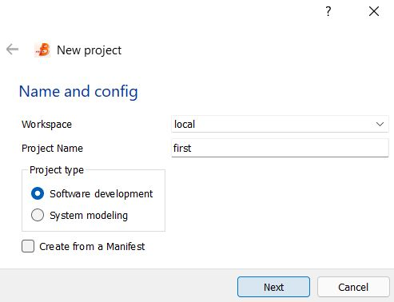
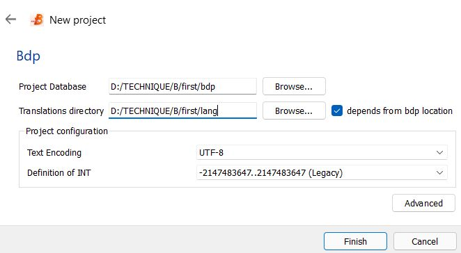
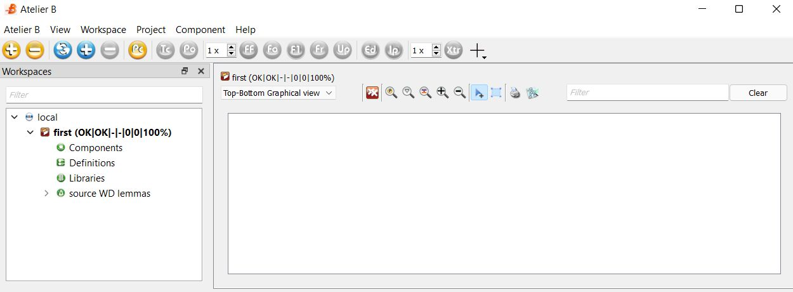
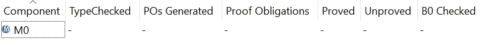
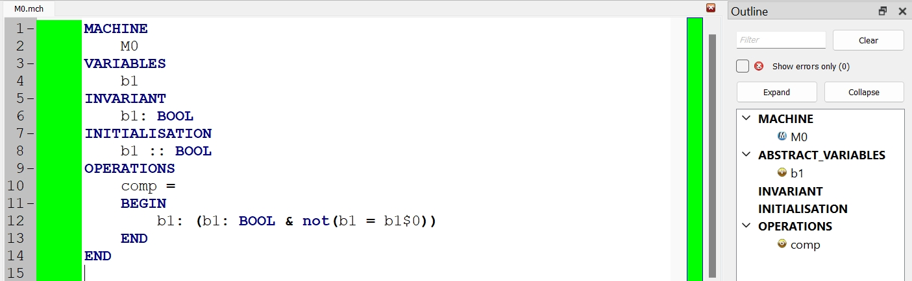
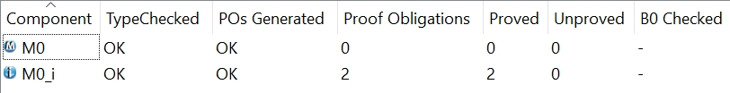

# Getting Your Hands Dirty

## Table of Contents

- [Installation](#installation)
- [Project Creation](#project-creation)
- [Adding a specification model](#adding-a-specification-model)
- [Adding an implementation model](#adding-an-implementation-model)
- [Proving models](#proving-models)
- [Code Generation](#code-generation)

## Installation

## Project Creation

To create a project, you can either:

* select the menu Atelier B / New / Project
* use the shortcut Ctrl+Shift+P
* click on the yellow + on the toolbar

The 2-step project creation wizard show up.

|  |
|:--:|
| First step of a project creation |

Leave wokspace as local (default). Type in a project name. Select a project type: either <mark style="color:blue;">software development</mark> or <mark style="color:blue;">system modelling</mark>.

Click Next than click Finish (no need to modify default parameters).

|  |
|:--:|
| The project database contains the files used for the various modelling and proof activities. The translation directory contains the source code generated from the B models. |

Finally the project is created, named _<mark style="color:blue;">first</mark>_, and empty.

|  |
|:--:|
| Atelier B main window when the project **first** has just been created empty. |

## Adding a specification model

The project should be open and selected. You can either:

- right-click and select New / Component
- type Ctrl+N
- or select the button blue button "+" 

A window shows up. You need to enter 3 informations: the name, the type (here it is a B machine i.e. a specification), and the directory where the file is going to be saved.
Enter M0 as name - the file is going to be saved as *M0.mch*. Select Next then Finish.
The component M0 is added to the project.

|  |
|:--:|
| Project status when component M0 has just been created. |

Let us edit the content of the file with a double-click on the component name on the status window.
We are going to model a Boolean variable *b1*, that is initialised non-deterministically. We also specify on OPERATION *comp* modifying the variable *b1* such as the new value of *b1* is diffrent from the previous one.

```
MACHINE
    M0
VARIABLES
    b1
INVARIANT
    b1: BOOL
INITIALISATION
    b1 :: BOOL
OPERATIONS
    comp =
    BEGIN
        b1: (b1: BOOL & not(b1 = b1$0))
    END
END
```

Once the model is typed in, save it with Ctrl-S. The editing window turns green seconds later, indicating that the model is correctly typed and provable.

|  |
|:--:|
| Model editor displaying color information about proof status. Green is proved, red is not proved. |

## Adding an implementation model

With the component M0 selected, create a new component. Select the type implementation. The field name should be now *M0_i*. 
Click Next, Next then Finish.

Let us edit the content. b1 is now a CONCRETE_VARIABLE (required for code generation), initialised with TRUE. The OPERATION *comp* is implemented with a IF-THEN-ELSE.

```
IMPLEMENTATION M0_i
REFINES M0
CONCRETE_VARIABLES
    b1
INITIALISATION
    b1 := TRUE
OPERATIONS
    comp =
    BEGIN
        IF b1 = TRUE THEN 
            b1 := FALSE
        ELSE
            b1 := TRUE
        END
    END
END
```
Once the model is typed in, save it with Ctrl-S. The editing window turns green seconds later.

## Proving models

Select the two components in the status window, press the blue button F0 (Automatic Proof Force 0).
After few seconds, the status window is updated with:

|  |
|:--:|
| The two components are fully proved automatically. |


It reads that both *M0* and *MO_i* are typechecked, their proof obligations have been generated. *M0* has no proof obligations associated while *M0_i* has 2. These 2 proof obligations have been proved. The 2 components are proved to be correct.

## Code Generation

Select the implementation *M0_i*, then right-click and select "Code Generator". A new window appears. Click OK.
Wait few seconds then select the project name, right-click and select "Open Folder".
The directory contains the two files *M0.mch* and *MO_i.imp*, and two directories "bdp" and "lang". Go to "lang/c".
It contains the two files generated *M0.c* and *M0.h*.

```C
#include "M0.h"

/* Clause CONCRETE_CONSTANTS */
/* Basic constants */

/* Array and record constants */
/* Clause CONCRETE_VARIABLES */

static bool M0__b1;
/* Clause INITIALISATION */
void M0__INITIALISATION(void)
{
    
    M0__b1 = true;
}

/* Clause OPERATIONS */

void M0__comp(void)
{
    if(M0__b1 == true)
    {
        M0__b1 = false;
    }
    else
    {
        M0__b1 = true;
    }
}
```


```C
#ifndef _M0_h
#define _M0_h

#include <stdint.h>
#include <stdbool.h>
#ifdef __cplusplus
extern "C" {
#endif /* __cplusplus */


/* Clause SETS */

/* Clause CONCRETE_CONSTANTS */
/* Basic constants */
/* Array and record constants */

/* Clause CONCRETE_VARIABLES */

extern void M0__INITIALISATION(void);

/* Clause OPERATIONS */

extern void M0__comp(void);

#ifdef __cplusplus
}
#endif /* __cplusplus */


#endif /* _M0_h */
```


