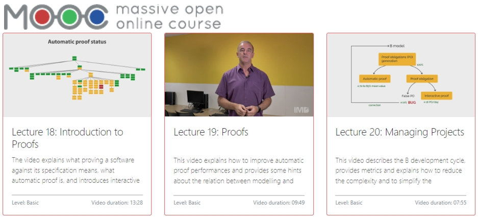
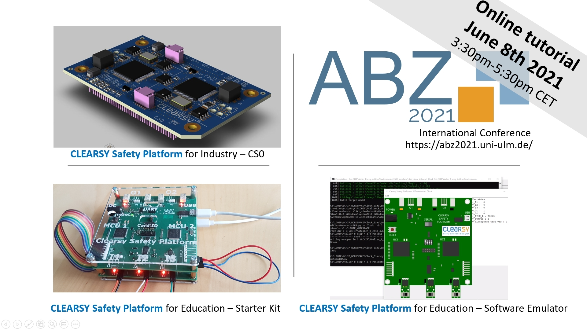

# Introduction to B

## Table of Contents

- [Introduction](#introduction)
- [Atelier B Reference Documentation](#atelier-b-reference-documentation)
- [B Training Slides](#b-training-slides)
- [Handbooks from MATISSE EU Project MATISSE](#handbooks-from-mATISSE-eu-project-matisse)
- [MOOC on the B Method](#mooc-on-the-b-method)
- [Repository of Formal Models](#repository-of-formal-models)
- [A Hardware Platform Programmed with B](#a-hardware-platform-programmed-with-b)

## Introduction

The B method is taught in many institutions and universities, on all continents, for:

- Software development (B language)
- System modeling (Event-B language)

The teaching is based on the [Atelier B "community version"](https://www.atelierb.eu/en/atelier-b-support-maintenance/download-atelier-b/) which is fully functional and fully usable for modeling, proof and C code generation.

B models can also be animated and verified (model-checking) with the ProB tool (https://prob.hhu.de/w/index.php?title=Main_Page/).

Below are a number of resources usable for education.

## Atelier B Reference Documentation

Several documents are available:

- [B Language Reference Manual](pdfs/manrefb.pdf): describes the B language
- [B Language Keywords and Operators](pdfs/symboles.pdf): displays the correspondance betwwen the B mathematical symbol and their ASCII counterparts
- [Type Checker Error Message Manual](pdfs/MessagesTC.pdf): lists all the error messages generated by the typechecker and their origin

## B Training Slides

3 sets of slides are available to discover the B method:

- [TRAINING B – Level 1: Understand B](pdfs/CLEARSY-Training-B-level-1.pdf)
- [TRAINING B – Level 2: Practice B](pdfs/CLEARSY-Training-B-level-2.pdf)
- [TRAINING B – Level 3: Prove B](pdfs/CLEARSY-Training-B-level-3.pdf)

## Handbooks from MATISSE EU Project MATISSE

This project was aimed at providing **M**ethodologies **a**nd **T**echnologies for **I**ndustrial **S**trength **S**ystems **E**ngineering. The focus was on B and Event-B. 3 Handbooks were written down, addressing different audiences:

- [Board-level Storyboard](pdfs/MATISSE-Boardlevel-handbook-13.pdf)
- [Project Manager's Handbook for Systems Construction](pdfs/MATISSE-ProjManagers-HandBook.pdf)
- [Practitioners Handbook](pdfs/MATISSE-Practitioners-Handbook.pdf)

The practitioners handbook provides a number of guidances when using B. 

## MOOC on the B Method

A [MOOC](https://mooc.imd.ufrn.br/course/the-b-method) dedicated to the B method (https://mooc.imd.ufrn.br/course/the-b-method) is available to all. It contains 20 videos for a duration of 6h50, covering the basics of the method, from modeling to project management. The site hosts the models used for the videos as well as the proof files. The MOOC was realized in collaboration with the Instituto Metropole Digital / UFRN (Natal, Brazil).

## Repository of Formal Models

Furthermore, the University of Düsseldorf hosts a [repository of formal models](https://github.com/hhu-stups/specifications/tree/master/prob-examples/B)  from a wide variety of industrial and academic modelers, which can be used for training and self-improvement.

## A Hardware Platform Programmed with B

The [CLEARSY Safety Platform can be programmed with the B language](https://github.com/CLEARSY/CSSP-Programming-Handbook) for the development of critical applications.

Among the two configurations of the safety platform (for education / for industry), the "for education" version is available as :

- An IDE (Atelier B + plug-ins) and
- either [a development board](https://www.clearsy.com/en/components/calculateur-clearsy-safety-plateform/) to run the compiled programs or its [software simulator](https://github.com/CLEARSY/tutorial-ABZ-2021).

The software simulator is available free of charge and without restrictions. It was demonstrated during a tutorial at the ABZ 2021 conference (see [tutorial video](https://www.youtube.com/watch?v=2IL_Wo2-0YM)).

The added value of the CLEARSY Safety Platform is that students can "bring things to life" (see modelling variables change on the simulator or LEDs flash on the board). Hands-on courses and sessions have been given around the world for the past four years and this has been well received by:

- theoretical profiles who can connect their abstract models to the physical world
- by the embedded systems / IoT profiles who can discover formal modeling and verification.

These cards are already used for master / master 2 courses in France, Germany, Italy, Canada and Brazil.