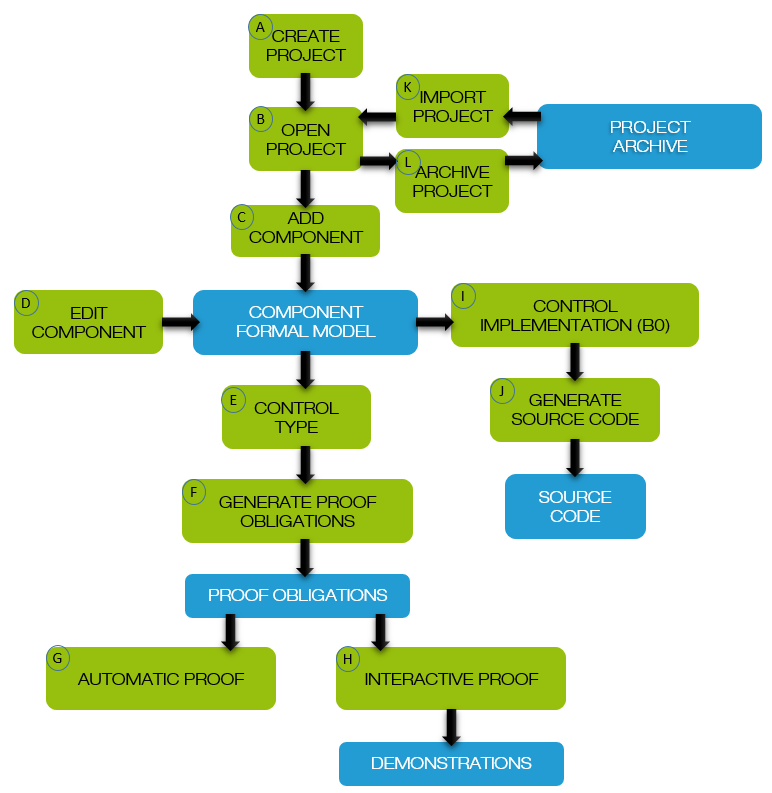

# The B Method

## Table of Contents

- [The Process](#the-process)
- [Activity Project Management](#activity-project-management)
- [Activity Proof](#activity-proof)
- [Activity Code Generation](#activity-code-generation)

## The Process

|  |
|:-:|
| The B Method consists of several activities to perform in the right order. |

Applying the B Method with Atelier B consists in appyling activities for:
- project management: activities A, B, C, D, K, L
- proof: activities E, F, G, H
- code generation: activities I, J

Proof and code generation are independant: generating code for a not (fully) proved project is possible, proving a project without generating code is also OK.

## Activity Project Management

### Create Project (A)
The subject is Software Development. 
By default, the project is going to be referenced in the *local* workspace. Another workspace can be specified if it was created before. 
The project can be also created from a [Manisfest File](12-files-architecture.md#manifest-file). 

### Open Project (B)

### Add Component (C)

### Import Project (K)

### Archive Project (L)

## Activity Proof

## Activity Code Generation