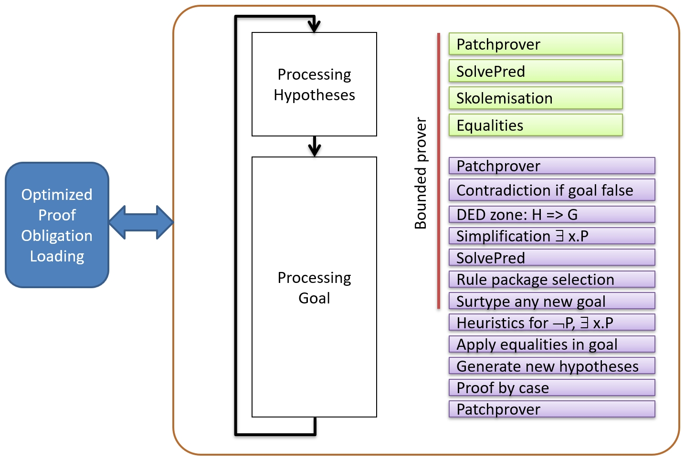
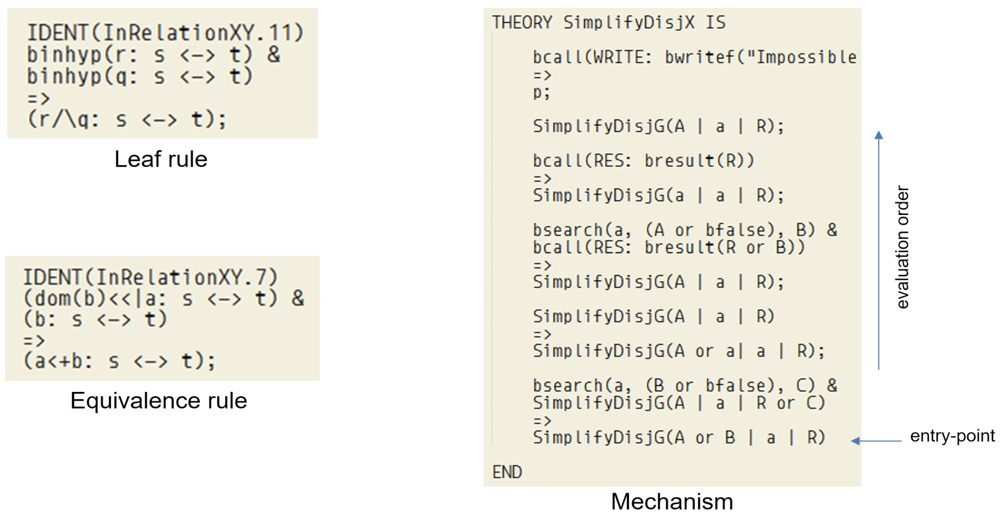
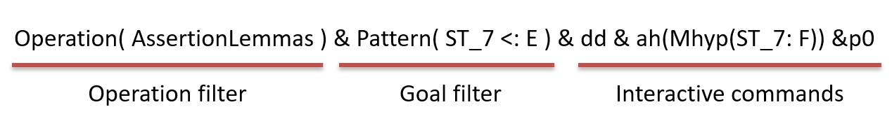
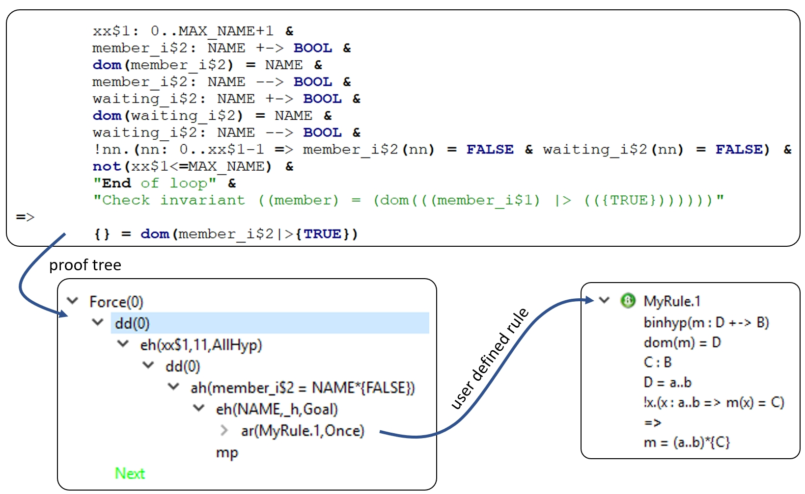
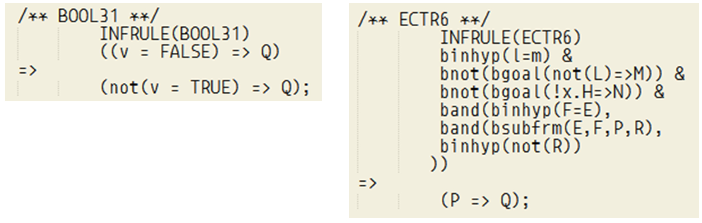
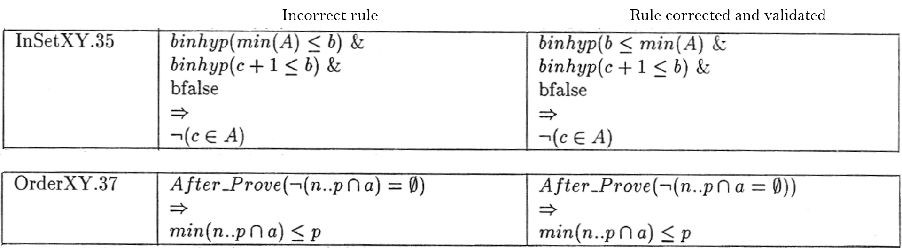
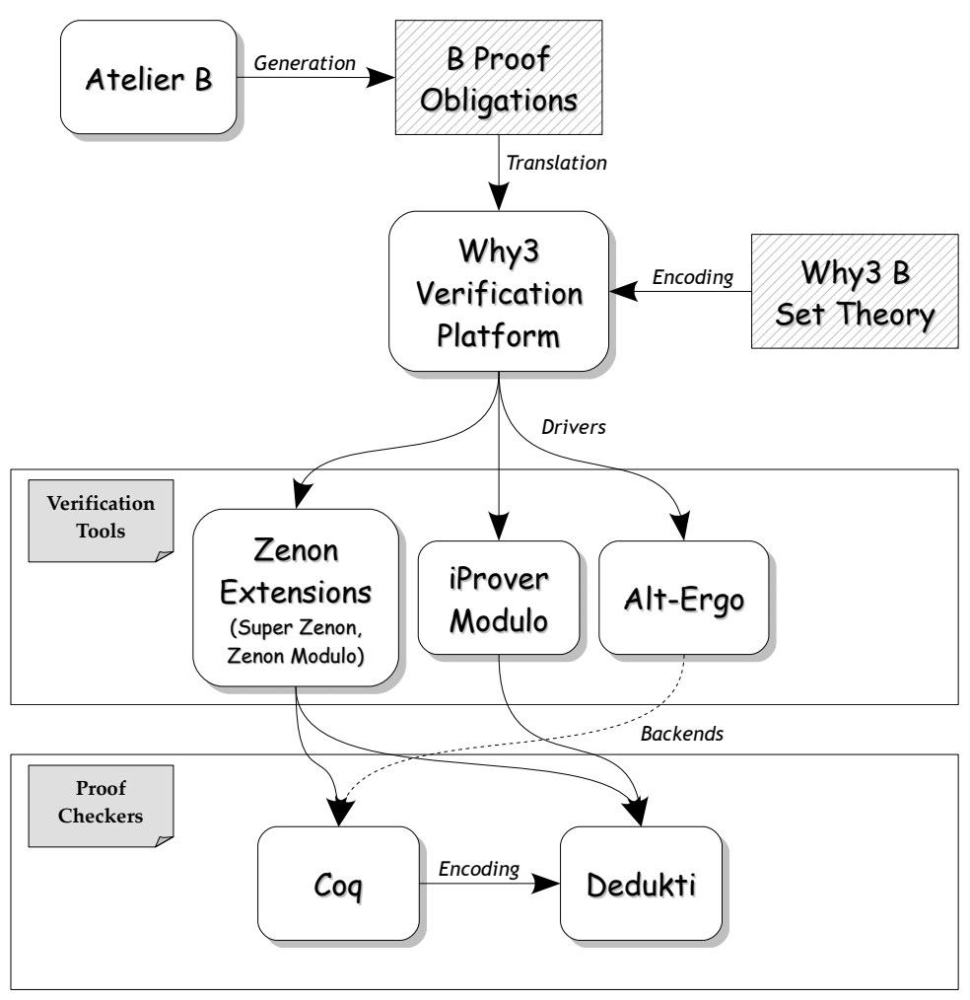

# Introduction to Mathematical Proof

## Table of Contents

- [A Short History](#a-short-history)
- [The Automatic Prover PR](#the-automatic-prover-pr)
- [Adding Interactivity](#adding-interactivity)
- [The Predicate Prover and the Rules Database Validation](#the-predicate-prover-and-the-rules-database-validation)
- [Improving with Research and Development](#improving-with-research-and-development)
- [Setting Up a Public Proof Obligation Data Set](#setting-up-a-public-proof-obligation-data-set)

## A Short History 

The B-Method has a rich history, leading to considerable research and progress in the area of formal methods, and to numerous industrial applications. Both language and tools have evolved over the years, since the first Atelier B toolset released in the early 90’s.
From 1993 to 1998, the Atelier B, initially developed by Alstom, was improved to support Meteor safety critical software design. Analysers, compiler, type-checker, and proof tools were specifically crafted to obtain a software that could control a train and complies with railways safety standards. The original fully automatic prover was completed with an interactive interface and a proof command language used to both save proof demonstration and create tactics that could be applied to many proof obligations at once. One strong requirement was to ensure a mean proof duration of 10 seconds per proof obligation. A project being composed of tens of thousands proof obligations, it allowed to regularly prove the B project when modified.
Finally when the project is completed, the proof obligations are generated again from models and the saved proof demonstrations replayed in order to obtain a 100% proven project.
From 1999 up to now, the proof kernel has been frozen as any modification could have prevented existing proof demonstrations to be replayed and could cost tens of thousands euros 1 (or more) per project just to reach 100% proven status again. Hence future improvements were aimed at adding new mechanisms or proof commands that would have no impact on existing demonstrations. Unavoidably, the several safety-related bug corrections published over the years have invalidated demonstrations, but it cannot be avoided as it must be ensured that a false positive demonstration cannot lead to a safety problem.

## The Automatic Prover PR

The Automatic Prover PR was developed as no other proof tool was available in the early 90’s to fulfil requirements (R1: supported logic and language, R2: computation time per PO, R3: automatic proof efficiency). PR is made of two distinct parts: a loader and a solver.

|  |
|:--:|
| Structure of PR |

### Loader. 
The loader is designed to minimise PO loading/unloading. PO could have thousands hypotheses, so unloading all hypotheses from memory when moving to the next PO is not optimal. The hypotheses are grouped into packages, corresponding to the different clauses of model B. PR unloads only those hypotheses that are no longer used and keeps the others. PO file format was structured accordingly.

### Solver. 
The solver generates new hypotheses and transforms the goal in order to obtain ⊤ (represented with
the predefined symbol btrue). If the solver is successful, the PO is considered proved. If not, the PO is unproved. A B project is valid only when 100% PO are proved. The solver, as well as most proof-oriented Atelier B tools, was developed with the THEORY language 2, close to PROLOG (but without cut) and able to parse B models. It is composed of an hypothesis processor and a goal processor. They are executed in sequence; a transition is fired when a processor cannot activate anymore any of its built-in mechanisms. The main idea is to simplify the goal while generating new hypotheses that will possibly match with leaf predicates in the proof tree (conditions or sub-goals in the mathematical rules).

|  |
|:--:|
| Example of THEORY language items. Single letter identifiers are wildcards and can match with any expression. The leaf rule is executed if the two hypotheses exist (binhyp are guards). The equivalence rule replaces the current goal with two sub-goals. Finally the mechanism SimplifyDisjX simplifies the disjonction A or B from any occurrence of a and the result is in R. The mechanism cannot be validated in isolation and requires to take into account its environment, including programming conventions (some variables have to be properly set before calling) |

### Hypothesis processor. 
The hypothesis processor is able to generate new hypotheses but not to modify existing
ones. the side effect when moving to the next PO and keeping modifications in the hypotheses stack.

### Goal processor. 
The goal processor is able to simplify the current goal, add hypotheses derived from existing ones, and to replace the current goal by one or several sub-goals. Simplification and addition of hypotheses are performed by mechanisms, goal transformation results from the application of mathematical proof rules.
These rules are written in THEORY language and are either part of the prover rules database or of the Patchprover (rules developed by users and specific to each project).

### Proof mechanism. 
The prover contains 35 mechanisms. The mechanisms were designed, improved then selected by engineers from different companies, based on experiments on several B projects representing a total of 3000 POs. The selection was made based on both the automatic proof percentage
and the complexity / difficulty to prove remaining POs. 

To comply with R2, the prover was decomposed in 2 parts: a bounded prover and an unbounded prover.
The prover is actionable through the parameter force, ranging from 0 to 3. The hypothesis processor is identical for both bounded and unbounded provers.

### Bounded prover. 
The bounded prover, corresponding to the force 0, comes with limited complexity mechanisms.
It is the most efficient prover configuration, used first during automatic proof, usually able to
demonstrate 70% of the proof obligations, with a mean execution time of 10 seconds.

### Unbounded prover. 
The unbounded prover includes heuristics that could generate infinite execution. Force
1 is an extension of force 0 prover where new hypotheses are more simplified by applying a stronger normalisation. Force 2 extends force 1 by generating more derived hypotheses. Force 3 extends force 2 by attempting proof by cases. These 3 forces usually increase automatic proof performance by 1 or 2 % each.

The structure of the prover, the mathematical rules database, the mechanisms constituting both bounded and unbounded provers, and their parameters were designed, defined, and optimised based on the B models developed by Matra from 1993 until 1998. Hence the proof performances were not guaranteed when symbols and predicates used are quite different from those in Meteor models. To improve automatic proof percentage, complementary mathematical rule databases are going to be used.
There is another version on PR, without the optimised loader and called MonoLemma ML, that is
actionable to demonstrate a single proof obligation. ML is used to power the Rodin platform as
[Atelier B provers plugin](https://wiki.event-b.org/index.php/)

## Adding Interactivity

With interaction between the user and the tool, we are seeking to improve proof performance. Interaction is not seen as a one-time action but as an investment in reducing the proof activity on the rest of the project.
Proof helpers available to the user are the addition of user defined rules, a proof-oriented script language, the definition of proof tactics and their selective execution, the conservation of demonstrations when the models change drastically, and graphical display of proof information elements.
### Addition of user defined rules. 
3 kind of rules can be developed with Atelier B: backward rules transforming a goal into 0 or more sub-goals, rewriting rules working on expressions and predicates, and forward rules generating new hypotheses (triggered when the Modus Ponens is activated). Apart from the Atelier B rules database, user defined rules may be added either in the PatchProver (usable by any B model in the project) or in component proof files (usable only by one B model). The PatchProver is central to the proof performance: it has to be set up gradually based on previous completed projects and managed with a SCM 4 system. It constitutes the palette that each user has to know well. The addition of user rules in proof component files is only permitted if no (combination of) rules is available in the PatchProver. All rules have to be validated before being used in a project, at least with a manual demonstration.

### Proof-oriented script language. 
It contains more than 30 commands allowing to modify the proof tree or to collect information about it 5. These commands are able to activate the bounded and unbounded provers, the processing of hypotheses for any force. They are also able to add hypothesis, initiate a proof by cases, trigger the Modus Ponens, start the Predicate Prover or simplify a goal with the Set Solver, and execute an external prover. To avoid long waiting times, some commands are associated with delays - the execution of these commands will not last longer than this delay that is a parameter of the command. Similarly, for provers that work better with a limited number of POs, it is possible to specify that only typing hypotheses or hypotheses having a symbol in common with the goal are selected for the proof.

### Definition of proof tactics and their selective execution. 
Proof-oriented commands can be saved as demonstration. These are the demonstrations that are replayed often to ensure that the project is still provable.
These demonstrations are supposed to be as generic as possible, to be applied on other similar POs. In the interactive prover, when at least one PO has been demonstrated, the user is asked if these demonstrations could be saved in the User Pass, a specific part of the component proof files that only contains proof tactics (generic demonstrations). These demonstrations can be tried on the remaining POs of the current component.
These tactics are ordered: the first one is tried on all unproved POs, the other ones on the remaining POs once the previous tactic has been applied. Naturally the most generic, efficient tactics have to be in the first places while the more specific and longest to execute have to positioned further down the list. In addition, it is possible to use filters to make the selection even more precise, by specifying the name of the operation and the form of the goal.

|  |
|:--:|
| Example of a proof-tactic filter, specifying the operation name, the shape of the goal, and the sequence of proof commands to apply |

### Conservation of demonstrations. 
A demonstration is attached to a proof obligation based on the local hypotheses, the goal, the operation name, and also its index (operation name.integer). When the B model is modified, the merger is a tool in charge of maintaining the link between the PO and the demonstration.
If the modification is too deep (new structure, new post conditions), the link will not be maintained. If the refactoring consists in changing variables names, either the demonstrations are generic enough to be replayed with success or the demonstrations will have to be edited manually. The various forces for the automatic prover already tried are stored and are not replayed if the model has not changed.
Graphical display of proof information elements. The interactive prover has been developed to provide a convenient interface to the user, displaying the current proof obligation and its related proof tree. However the number of elements involved in the process is too large to be displayed in full. Instead displaying these elements requires an action from the user not to clutter the GUI:
• Hypotheses are searchable with the command SearchHypothesis.
• Mathematical rules are searchable with the command SearchRule. Rules are also available as list
(either as a tree, grouped in THEORY, or as an ordered list of applicable rules where valid guards are in bold).
• A logical analyser abstracts the structure of predicates and expressions, in order to ease the writing of rules.
• The model editor integrates proof information directly in the model (the number of proof obligations per line, the list of POs associated to a line and their goal, a colour code indicating the proof percentage per line). The automatic prover (bounded prover force 0) is executed in the background every time the model is saved and the status updated within few seconds. It helps the user to adapt its modelling in order to ease the automatic proof.
• The possibility to try everywhere (locally or globally) a successful demonstration as soon as a PO is proved, with a single click.

Proving a B project requires to use all available tools and features to complete it efficiently. The algorithm to be used can be broken down into a few points:
• generate proof obligations, trigger automatic prover force 0 and 1, execute the current proof tactics from UserPass;
• examine unproven POs if any, be sure that all POs are correct. Correct the model for false POs;
• for each PO, understand why the PO is correct, search for useful hypotheses, search for applicable rules, define a demonstration (see Fig. 4), apply it, enrich the proof tactics of the User Pass if possible;
• if the proof is difficult, try rephrase your modelling with other symbols/expressions/predicates. Add assertions if convenient;
• When the model is fully proved, regenerate the POs then unprove them all, make sure that POs can be reproved by using Proof Replay, make sure that user defined rules are valid.

## The Predicate Prover and the Rules Database Validation

From 1993 to 1998, the Automatic Prover was reverse-engineered, documented, tested, and extended to
be ready for RATP qualification. It was made available to the Community and presented at the occasion of B-User Group meetings. The mathematical rules database was published to enable academic research.
Proof mechanisms were validated in conformance with software development best practices: documentation peer review, source code inspection, and requirement-based test-bench.
Mathematical rules database is made of 2700+ rules. Its validation was decomposed in two activities: automatic proof with a dedicated prover, the Predicate Prover PP, and manual proof for the rules not proved or not handled by PP.

### Automatic proof. 
The Predicate Prover PP was developed specifically to automate this error-prone activity.
Invented by Jean-Raymond Abrial [2], PP is based on semantic tableau proof system. The 116 inference rules are described by conditional rewrite rules and their application is controlled by strategies (case-split, instantiation of quantified predicates, etc.). The specification of PP was made public to encourage formal research. Its specification was also peer reviewed and traceability with source code was established. Its validation consisted in developing an automaton able to replay the demonstration 8 to obtain a contradiction.
Then PP has been included into a professional tool including checkers and translator, to specifically support industrial projects. PP is efficient when the number of hypotheses is low, which is the case for mathematical rule validation. The use of PP for proof of OP requires hypothesis filtering to maintain its proof performance.

### Manual proof. 
The mathematical rules that are not handled or proved by PP had to be verified manually.
A form had to be filled with the source code of the rule, its manual translation into mathematical predicate, the verification of its correct typing and the absence of name collision between identifiers and quantified variables. Then a mathematical demonstration with no imposed format had to be provided. Each form was reviewed by a panel of about ten people from five different companies. The remarks made had to be taken into account by the author of the form and then the rule had to be reviewed again, as long as remarks remained. Finally a third party company was in charge on reviewing all forms and to evaluate if the demonstrations were convincing. The validation was completed when all manual demonstrations were deemed to be convincing. The forms and the evaluation report were added to the validation file.
The validation of the rules was a long process, which lasted much longer than the 5 years of Atelier B Meteor’s development. Some errors were detected after 1998. Where possible, the rule was corrected and industry was invited to re-prove their projects. Most of the time, the rules were ”almost right”. Often a restriction on the application domain was missing. It was also detected that some rules were duplicated: as the validation of rules is unitary, this fact remained undetected for some time. Circumventing the problem required to replace the duplicated rule by a non-applicable rule.

|  |
|:--:|
| Proof tool GUI used to validate user defined rules. It allows to implement a cross validation algorithm based on a formal tool (Predicate Prover), and independent per review, that is accepted for safety demonstration by the railway standards. |

During the development of PP, a first attempt to verify the rules database occurred in 1995. 1535 rules handled by the tool, the other rules were not processed because of functional limitations (sequences not supported, several guards not yet translated). 59 were detected false, 55 were corrected and verified by PP successfully, 4 were removed because they were wrong (or too specific). A dedicated proof tool with GUI was designed and integrated to Atelier B to provide a systematic verification framework.

|  |
|:--:|
| Example of PP inference rules. The rule BOOL31 replaces one goal by another. The rule ECTR6 is a success if it exists one equality F=E in hypothesis such as, by replacing E by F in P, we obtain R, not(R) being in hypothesis. |

Finally a few tens of rules have been corrected since 1998. Their detection is often due to incorrect models proved successfully. Backward analysis allows to locate the origin of the error, if it is a rule. If the cause is a faulty mechanism, then the analysis is our responsibility, as the code of the mechanisms is not accessible through the tool, unlike the mathematical rules.

|  |
|:--:|
| Rules found incorrect in 1995. The rule InSetXY.35 is incorrect as the first searched hypothesis should be b ≤ min(A). The typing of the predicate to prove ¬(n..p∩a)=∅ is oncorrect (the brackets are misplaced). |

## Improving with Research and Development

To ensure improved proof performance and thus lower development costs, extending interactive proof
commands and adding rules packages have reduced scope because the limitations of the proof kernel remain.

So improvements were sought through features implemented externally, i.e. coupling with third-party provers and using AI for easing interactive proof. Below are listed the main contributions to the proof kernel.

### ProB. 
In the early 2000’s, formal data validation started to become more widespread in the railways. In particular, the ProB model-checker was first demonstrated during the EU project DEPLOY. After some optimisations, ProB was able to fully handle large size metro data and validation rules, resulting in the generation of one B machine per validation rule and instantiated with the data related to this rule. At the same time as a new type of project, data validation project, was added to Atelier B 4.3, ProB was added as an interactive command. Its behaviour is similar to the predicate prover: it does not modify the goal, only trying to demonstrate it. It comes with a time limit (maximum duration) and the possibility to reduce the number of hypotheses by selecting those having one symbol in common with the goal. PRoB allows better handling of arithmetic goals and case-based proofs on reduced domains.

### Zenon, iProver, and Alt-Ergo. 
BWare (2012-2016) was an industrial research project aimed at providing a mechanised framework to support the automated verification of proof obligations. The adopted methodology consists in building a generic verification platform relying on different automated theorem provers, such as first order provers and SMT solvers. This generic platform is built upon the Why3 platform for deductive program verification. The considered first order provers are Zenon and iProver Modulo, while we opted for the Alt-Ergo SMT solver. In this framework, B proof obligations are translated by a specific tool into Why3 files, which are compatible with a Why3 encoding of the B set theory. From these files, Why3 can produce (by means of appropriate drivers) the proof obligations for the automated theorem provers, using the TPTP format for Zenon and iProver Modulo, and a native format for Alt-Ergo. This translation together with the encoding of the B set theory aims to generate valid statements that are appropriate for the automated theorem provers, i.e. whose proofs can be found by these provers. Finally, once proofs have been found by these tools, some of these provers can generate proof objects to be verified by proof checkers. This is the case of Zenon, which can produce proof objects for Coq and Dedukti, and iProver Modulo, which can also produce proof objects for Dedukti. An initial bench of 13,000 proof obligations, issued from several industrial projects, was constituted to evaluate the BWare platform. Atelier B PR prover was able to demonstrate 85% of them, Alt-Ergo 58%, iProver Modulo 19 %, and Zenon less than 1%. As can be observed, the first order provers encounter difficulties, which can be explained by the fact that these provers do not know the B set theory. At the end of the project, Alt-Ergo was able to demonstrate 98% of the PO, Zenon 95%, and iProver 28%. We also completed the set of provers: CVC4 was able to demonstrate 94% of the PO, Z3 84%, Vampire 78%, and E 61%. It appears that the project and the supply of POs has improved the performance of some provers. In the case of Alt-Ergo, the remaining POs are existential and require human intelligence
to prove.

|  |
|:--:|
| The BWare Platform for the Automated Verification of B Proof Obligations. |

### Alt-Ergo. LCHIP (2016-2020) was an industrial project aimed at developing a safety computer programmed
with B and with enhanced proof capabilities. Alt-Ergo prover was selected from the excellent results obtained during the project BWare. One possibility for improvement was to specialise the production of the Why3 to exploit Alt-Ergo strong points. However the input B models, issued from the safety library, were quite different (lower level modelling) with more arithmetic and bit-wise Boolean functions.
In the meantime, Why3 and its programming language WhyML have evolved enough to prevent reusing
Why3 generator developed during BWare. Finally the 5000 PO generated from the safety library models were translated into SMT-LIB format and proved with 3 provers: Alt-Ergo proved 56% of the PO, CVC4 54%, and Z3 31%. The results are disappointing, but illustrate the difficulty to develop a universal prover / solver and to maintain a toolchain over the time.
Proof drudges. DISCONT (2017-2021) aims to provide efficient and easy to use refinement and proof-based techniques and tools that scale to complex systems and offer more convenient and automatic proof platforms centred around B and Event-B, with Atelier B. Iapa is an extension of Atelier B aiming at both integrating additional proof engines and offering hypotheses selection facilities to the user. The iapa tool is invoked within Atelier B on a given component, once the proof obligations of that component have been generated and from the XML-based file. Navigating through these proof obligations is a first core functionality available in iapa. Iapa comes with 6 commands for selecting hypotheses and identifiers 10, in order to limit the number of hypotheses used to prove a goal. Iapa then calls third-party provers through Why3 interface. Finally iapa offers the possibility to take into account proof obligations that are only proved by more than one external prover, and thus to improve automatic proof percentage.

### SMT and SAT solvers. 
BLaSST (2022-2026) is a research project project aimed at bridging combinatorial and symbolic techniques in automatic theorem proving. The current approach to encoding POs arising from B models in SMT solvers is based on rewriting set-theoretical expressions into pure first-order logic with a primitive binary predicate representing set membership. With this approach, the structure of the original formula gets lost and it introduces many quantifiers that are difficult for solvers to handle. Instead, BLaSST will enhance the solvers to handle a richer input language based on fragments of higher-order logic. In this way, sets and relations can be represented by their characteristic predicates, and the solver can exploit the structure of the original formula, flattening it only when necessary. In particular, we will explore specific strategies for handling higher-order terms that arise from expressions of the B language. The two techniques
described previously will be combined in order to embed in a solver with a highly expressive input language the power to reason combinationally. Specifically, we expect that SMT solvers will be able to recognize variables for which a finite set of a priori known values can be relevant and propagate these values in the sense of SAT solving. Similar techniques are used today for reasoning efficiently about bit vectors in SMT solving, and we intend to lift them to POs arising from B models. Second, we will explore to which extent it is possible to generalize the production of counter-examples and abductive reasoning beyond SAT-based encodings. The challenge here is to find useful compromises: there is no hope for fully general techniques and some of the theoretical bases are conflicting.

### Dedukti. 
ICSPA (2022-2026) is a research project aimed at enabling sharing and reusing proofs and theories
coming from other proof systems for both B/Event-B and TLA+. The logical framework λΠ-calculus
modulo theory, implemented in the system Dedukti, allows to express any formal proof system. We propose to use Dedukti as a unique backend for both B/Event-B and TLA+, where proofs can be verified. This will not only provide confidence in the proofs obtained, but also enable interoperability between proofs, which goes hand in hand with interoperability of models, which we are also aiming for in this project. Importing theories from Dedukti will provide users of B/Event-B and TLA+ with access to their mutual formal library, which has been impossible until now although they are both set-theory oriented.

### AI for Easing Proof Process. 
AIDOART (2021-2024) is a research project aimed at to providing a modelbased framework to more efficiently support the continuous software and system engineering of CPSs and CPSoS via AI-augmentation. Our main goal is to develop a module within the Interactive prover that can learn interactive theorem proving from the developer and adapt it to unsolved proofs of the system. Such a module is also expected to provide hints based on PO inspection, rules database survey, and analysis of existing PO demonstration for the project. In this respect, examples of railways systems written in B, with complete specifications and thousands of proofs, are going to be used to train machine learning infrastructure.
Unsupervised and supervised learning phases are expected to provide automatic demonstration. Another phase will address the commands with parameters and possibly the reuse / generation of mathematical rules.

## Setting Up a Public Proof Obligation Data Set
Proof obligations are computed from B models (see Fig. 10) to cover several aspects: correctness, overflow, and well-definedness. The first proof obligation generator was initially developed with the THEORY language. It contained many hard-coded optimisations making it difficult to evolve the B language. The invention of the Event-B in the 2000s required to develop a new generator, supporting both B and Event-B languages. The PO file format was left unchanged, but the core of the generator has been split into 2 parts: the generation engine itself developed in C++ and the theoretical proof obligations expressed in XSLT that could be modified on the fly without requiring to recompile the engine. Adding Event-B support as well as REAL and FLOAT numbers to Atelier B was greatly eased by this decomposition.
Atelier B historically used custom data formats and languages. These formats have lasted for several decades because redesigning them would have involved too great a development effort. Recent developments provide alternative tools using XML based formats to facilitate the study of B proof obligations and the connection to third party provers. [Apero](https://github.com/CLEARSY/apero) (Atelier B oPEn ResOurces) is a repository providing resources collected during the last decades, for software component development using the B method and for system modelling using Event-B. Proof obligations are anonymous (identifiers are replaced by random ones). They are issued from industry projects involving a large range of human modellers and providing some diversity some diversity in the style. Most of the B operators appear in the POs. All proof obligations are reputed true as they were demonstrated automatically or interactively for these projects. As such, they provide a solid basis for the evaluation of provers.

### The proof obligation format pog. 
pog is a XML-based format for proof obligations. Its definition is provided in the pog.xsd file as an XML Schema Definition. This definition is documented through annotations directly available in the source file. We use xsltproc to generate an HTML version of the documentation.

### Proof obligation data. 
We have collected a large number of proof obligations stemming from the application
of the B method and of Event-B for both research and development projects. The data is provided as a collection of data sets, each data set corresponding to a specific development. Each data set contains files in pog format. At the date of writing this article, APERO contains 681,285 POs.

