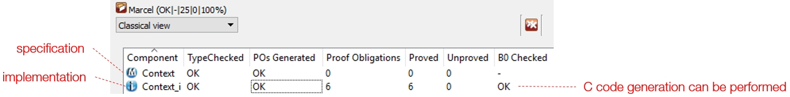
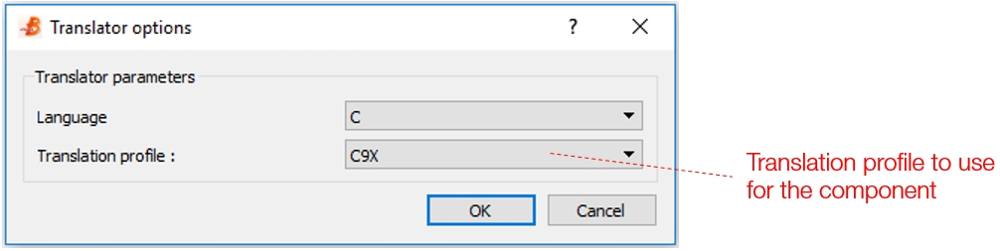
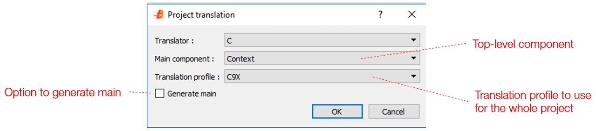

# Introduction to Code Generation

Code generation is always a tricky way of producing code, as the code is generated by a tool (seen as a black-box, behaviour not modifiable) from a model and the obtained code slightly differs from what could have been obtained manually. Some rules have to be considered to avoid desesparation while trying to get expected code:

* **a specific code generator is required for each target platform** . Hence thinking that a single code generator would do the job for all your projects will generate massive frustration when linking obtained code with third party code.
* **know your code generator capabilities** , define properly your software interface and how data/functions are implemented (full force implementation or basic machine)

## Generating C source code

Generating C source code requires a software development project. You should choose this option when you create your project. It is not possible to change the nature of a project after its creation.

Code can be generated in two modes:

* **component mode**: you select a component in the component view, you right-click then select "code generator". The dialog below shows up. After having selected the proper translation profile, click OK. Unless you got error messages, the code has been generated into the lang/c directory of your project. If you select a machine, you get a c file and a header file (.h) with the same name as the selected component.

* **project mode**: you select your project in the workspaces view, you right-click the select "code generator". The dialog below shows up. After having selected the proper translation profile, the top-level component and possibly checked the "generate main" option, click OK.

Several translation profiles are available:

* C9X
* Project
* Light
* 01
* PIC