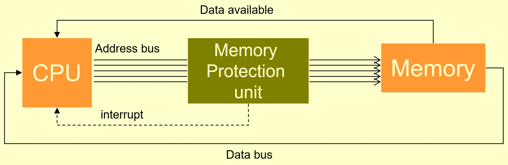

# Security Policy

## Introduction

This example demonstrates how to specify a system specification.

## Natural Language Description

We consider a smart card that we want to certify at EAL5+ level. It is necessary to model the security policy and to verify by proof that it is consistent.

We define:

* the objects implemented in the security policy and;
* the expected security properties,

in terms of access rights to the various memories according to the type of process executing a given operation.



### Global model;

* Representing the operation of the CPU, MPU memory system;
* Focused on memory access management

### Objects

| Object | Values | type |
| ------ | ------ | ---- |
| process mode | USER or SUPERVISOR | tMODE |
| memory type | RAM, PUBLIC ROM or SECURE ROM | tMEMORY |
| memory content | DATA or CODE | tCONTENT |
| operation | READ, WRITE or EXECUTE | tOPERATION |
| access | GRANTED or NOT GRANTED | tRESULT |

### Implementation of the security policy

Each time an attempt is made to perform an operation to a memory slot for a process mode, then the access is:

* either allowed (GRANTED) or
* not yet allowed (NOT GRANTED)

## Modelling principles

The memory is abstract (we do not manipulate addresses but memory cells): abstract set MEMORY.

Indication functions allow to associate to each memory cell

* Its type (memory map): MEMORY\_TYPE : MEMORY --> tMEMORY;
* Its content: MEMORY\_CONTENT : MEMORY --> tCONTENT

Four variables are defined:

* currentCell                      currentCell : MEMORY
* currentOperation            currentOperation : tOPERATION
* currentMode                   currentMode : tMODE
* currentResult                  currentResult : tRESULT

Properties are permanently checked by these four variables.

Below is the skeleton of the B machine politique.mch:

```
SYSTEM politique
SETS
    MEMORY;
    tMEMORY={RAM, ROM_SECURE, ROM_PUBLIC};
    tCONTENT={DATA, CODE};
    tMODE={USER, SUPERVISOR};
    tOPERATION={OP_READ, OP_WRITE, OP_EXECUTE, OP_NONE};
    tRESULT={GRANTED, NOT_GRANTED}
CONSTANTS
    MEMORY_TYPE, MEMORY_CONTENT
PROPERTIES
    MEMORY_TYPE : MEMORY --> tMEMORY & 
    MEMORY_CONTENT :  MEMORY --> tCONTENT
VARIABLES
    currentCell, currentOperation, currentMode, currentResult
INVARIANT
    currentCell : MEMORY &
    currentOperation : tOPERATION &
    currentMode : tMODE &
    currentResult : tRESULT 
INITIALISATION
    currentCell :: MEMORY ||
    currentOperation :: tOPERATION ||
    currentMode :: tMODE ||
    currentResult :: tRESULT 
EVENTS
Init =
ANY cell, operation WHERE
    cell : MEMORY &
    operation : tOPERATION
THEN
    currentCell := cell ||
    currentOperation := operation ||
    currentResult := NOT_GRANTED
END;

ChangeMode =
ANY mode WHERE
    mode : tMODE & not(mode=currentMode) &
    currentOperation = OP_EXECUTE &
    currentResult = GRANTED
THEN
    currentMode := mode
END
END 
```

This specification needs to be completed with more events and invariants. One event and one invariant are given below.

#### event EXECUTE access in RAM

If the current memory location is RAM, the memory cell contains CODE, and the current operation is EXECUTE, then access is granted.

```
    executeRAM =
    SELECT 
        MEMORY_TYPE(currentCell) = RAM &
        MEMORY_CONTENT(currentCell) = CODE &
        currentOperation = OP_EXECUTE 
    THEN
        currentResult := GRANTED
    END
```

#### invariant ROM\_SECURE out of reach from USER

A memory cell of type ROM\_SECURE can only be read in SUPERVISOR mode.

```
    MEMORY_TYPE(currentCell)=ROM_SECURE &
    currentOperation = OP_READ &
    currentMode = USER
=>
    currentResult = NOT_GRANTED
```
