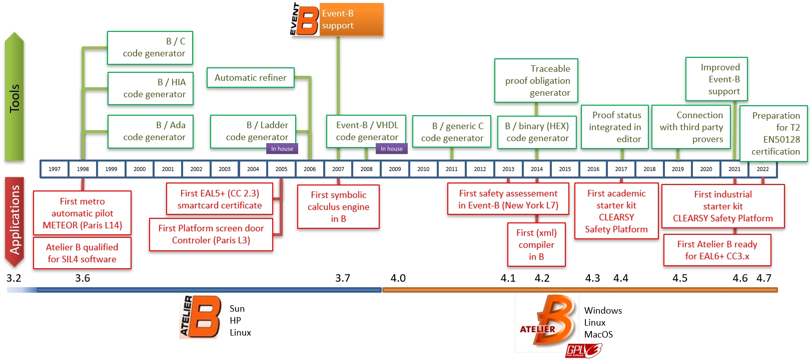

# Preface

The **B method** is a method of software development based on B, a tool-supported formal method based on an abstract machine notation (AMN), mainly used in the development of computer software. Both specification and implementation are modelled with the B language. The models are proved to be coherent and that implementation doens not contradict its specification. Code is then generated from the implementation model.

[Atelier B tool](https://www.atelierb.eu/en/) implements the B method and has been used for safety critical software since 1998 with [Meteor](https://en.wikipedia.org/wiki/Paris_M%C3%A9tro_Line_14), the first automatic metro operated in Paris. Since then, more then 30% of the automatic metros worldwide make use of the B method for the onboard and trackside safety critical software, with the [Urbalis](https://www.clearsy.com/en/references/urbalis-evolution/) (Alstom) and Trainguard (Siemens) product lines. 

A number of resources are available to learn the language (books, articles, websites, [MOOC](https://mooc.imd.ufrn.br/course/the-b-method)).
This repository is specifically aimed at providing support to use the Atelier B when modelling in B, proving, and generating code. 

> A method without a tool is useless.

With these resources, you will better understand and improve your interactions with the tool. There are many ways to model a function with B, some ways produce elements simpler to demonstrate, other ways lead to elements more difficult to demonstrate. Finally some B features cannot be translated into C code and your model needs to be adapted (the B0 language, a restriction of the B language, comes with a number of constraints).

The most difficult part is probably the proof activity that is quite a unique kind of interaction for a software developer. Firstly using the automatic prover first and then going through the remaining proof obligations for visual inspection is enough to get convinced that the models are in a good shape. The next step is to start interactions with the interactive prover and understand how it works. 

## Why B ? 

**B is for proving**. It is not primarily designed for programming with nice and elegant features. You write a specification, add properties, describe a behaviour, and then you get a proof that everything is coherent. You cannot demonstrate that your model is complete (you never know if something from the picture is missing) nor it is optimal (minimal size software for example). You cannot demonstrate that your specification is the right one (if you specify a right turn but the system requires a left-turn for your vehicle, well it is a bad decision ...). All what you get is the proof that the model of your implementation complies with its specification. Cross verification (human-based) with informal specification is then required. Code generation is also possibly a source of mistake (the code generators are rarely mathematically proved) requiring peer review (B implementation language is very close to generated C code). If you are developping safety critical systems, you are probably using redundant code generators compiled for a specific hardware executing the binaries in parallel with a voter for comparing behaviour during execution.

If:
- you are good at abstracting things
- you want to control every line of your software
- you found your teacher's mathematical demonstrations in high school interesting

then it is more than probable that you are fit for B (and vice-versa).

## Why not B ? 

After almost 30 years of experience with the formal methods in industry, we consider that
> If there is no risk of human death, there is not much point in using formal methods. 
However this is not always true: 
- formal methods are mandatory for the highest level ([EAL7](https://en.wikipedia.org/wiki/Evaluation_Assurance_Level#EAL7:_Formally_Verified_Design_and_Tested))of security products, 
- Microsoft makes use of formal methods for checking specific aspects (see [Dafny](https://www.microsoft.com/en-us/research/publication/getting-started-dafny-guide/))
- Companies like [Runtimeverification](https://runtimeverification.com/) use formal methods to verify Smart Contracts for crypto-currencies.

But this is true often enough to be considered as a rule of thumb.

Moreover if:
- you are not good at abstracting things
- you tend to leave the writing of specifications to others and to "think with your thingers"
- the fact that your software contains bugs does not prevent you from sleeping well at night

then it is more than probable that you are not fit for B (and vice-versa).

## Outline of the Book

This book is organized into six parts.

**Part I** introduces to Atelier B.

[Chapter Introduction to B and Event-B](docs/01-intro-b-event-b.md) gives a quick introduction to both the B method (for software development) and Event-B (for system modelling).

[Chapter Getting your hands dirty](docs/02-getting-your-hands-dirty.md) explains how to install Atelier B, create a project, edit and prove a model, and generate the related code.

**Part II** is focused on modelling with B for software development.

[Chapter Example: Fuel Level](docs/fuel-level.md) is a complete example for the measurement of the fuel level in a tank.

[Chapter Example: Switch](docs/switch.md) is a complete example for the measurement of the position of a switch.

**Part III** is focused on modelling systems with Event-B.

**Part IV** explains how to prove models with Atelier B

**Part V** explains how to generate C code with Atelier B

**Part VI** includes material that is important for any serious B practioner.

[Chapter References](docs/references.md) contains a number of useful articles and web pages.

[Chapter Troubleshooting](docs/troubleshooting.md) lists a number of problematic situations and related solutions.

## How to Use This Book

The intended audience for this book is anyone who wants to become an advanced B user.
There are several recommended paths through the book:

*   *In an Introductory Formal Methods Course:* Concentrate on parts I, II, and III.

*   *In a B Course:* Concentrate on parts I, II, IV, and V.

*   *In a Event-B Course:* Concentrate on parts I, III, and IV.

*   *In an Advanced Programming Languages Course:* Concentrate on parts I, II and V.

*   *For the Professional B Programmer:* Read as much of the book as possible, and refer back to it often.

## Supplementary Texts and Reference Books

*  *The b-method: an introduction*, Steve Schneider, Palgrave publisher, 2001 

*  *Software development with B*, Shin Nakajima; Hironobu Kuruma; Shin'ichi Hon'iden, Kindai Kagakusha publisher, 2007

*  *Program development by refinement: case studies using the B method*, Emil Sekerinsky; Kaisa Sere, Springer publisher, 1998

*  *Spécification formelle avec B*, Henri Abrias, Hermes publisher, 2001

## Acknowledgments

A great many people contributed to this collection of resources over the last 3 decades.

Original material, useful suggestions, corrections, and additions were made by:

Nicolas Ayache, Lilian Burdy, David Deharbe, Florian Jamain, Etienne Prun, Antoine Requet, Denis Sabatier (CLEARSY)

Over the year, useful feedback has been collected from teachers, students, francelances from most countries in the world.

----------------------